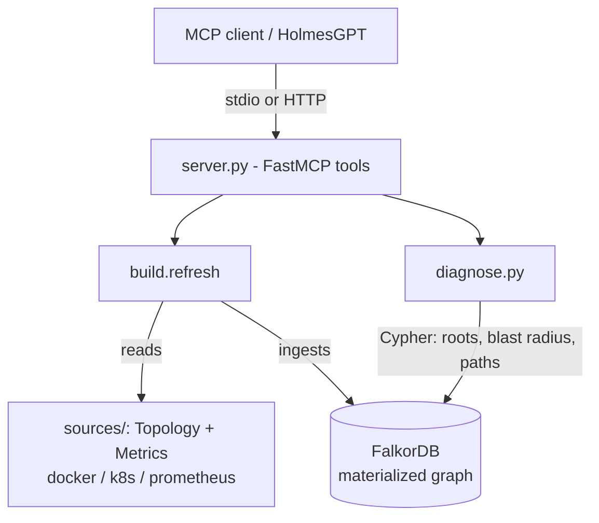

# woodpecker-mcp


A **materialized service dependency graph as an MCP toolset.** It gives an LLM
agent such as [HolmesGPT](https://github.com/robusta-dev/holmesgpt) the one thing
those agents do not keep: a persistent, queryable graph of how services depend on
each other, so root cause is a deterministic graph traversal instead of a
per-investigation guess.

Holmes stays vanilla. It launches woodpecker-mcp as a subprocess (or connects
over HTTP) and discovers its tools. No fork, no custom image.

---

## Why this exists

HolmesGPT markets a "Runtime Dependency Graph", but its source has no graph data
structure, no graph database, and no graph-traversal code. It infers relationships
on the fly from traces, Kubernetes owner-refs, and metric labels during each
investigation, then discards them; root cause is whatever the model concludes via
a "five whys" prompt. That is deliberate (freshness, statelessness, breadth), but
it has costs that a materialized graph removes:

| | Holmes (inferred) | woodpecker-mcp (materialized) |
|---|---|---|
| Where relationships live | model context, one investigation | a graph database (FalkorDB) |
| Root cause | reasoned per run (non-deterministic) | deepest-failing-service, one Cypher query (exact, repeatable) |
| Blast radius | re-derived each time | variable-length path traversal |
| Explore it yourself | no | yes (browser UI + Cypher) |
| Blind-spot detection | no | yes |

---

## How it works



The graph is rebuilt from live sources on each query (or from a static topology
file), then all reasoning runs as Cypher against the store.

---

## Quickstart

```bash
# 1. Run the graph backend (FalkorDB; browser UI on :3000)
docker run -d -p 6379:6379 -p 3000:3000 falkordb/falkordb:latest

# 2. Install Holmes + woodpecker-mcp (same venv = simplest)
pip install holmesgpt woodpecker-mcp

# 3. Point HolmesGPT at it
holmes ask "find the root cause of the current incident" \
  -t examples/holmesgpt-toolset.yaml
```

---

## Install

```bash
pip install woodpecker-mcp                 # FalkorDB backend (default)
pip install "woodpecker-mcp[kuzu]"         # add the embedded Kuzu backend
```

woodpecker-mcp stores the graph in **FalkorDB**. Run one:

```bash
docker run -d -p 6379:6379 -p 3000:3000 falkordb/falkordb:latest   # :3000 = graph browser
# or: docker compose up -d        # FalkorDB + woodpecker-mcp together
```

---

## Wire into HolmesGPT

For a `pip install holmesgpt` CLI, integration is **config-only** - HolmesGPT
already ships the MCP client, so there is no Holmes code, fork, or plugin to
build. The whole flow:

```
pip install holmesgpt woodpecker-mcp  ->  run FalkorDB  ->  drop in one YAML  ->  holmes ask -t
```

### Fast path (`woodpecker-mcp setup`)

```bash
pip install holmesgpt woodpecker-mcp
woodpecker-mcp init        # guided Q&A -> writes a filled-in .env
woodpecker-mcp setup       # start FalkorDB, wait until ready, register the toolset
holmes ask "find the root cause of the current incident"
```

- **`init`** asks a few questions (graph backend, topology, metrics) with numbered
  options and defaults, then writes a `.env` containing only the vars your choices
  need - no hand-editing a full template. `--defaults` (or `-y`) skips the prompts
  and writes the commented template instead; `--force` overwrites an existing
  `.env`. When stdin is not a TTY (CI, piped) it falls back to the template
  automatically, so it never hangs.
- **`setup`** starts FalkorDB in Docker, polls it until it answers
  (`FalkorDB is ready`), then merges the `woodpecker-graph` toolset into
  `~/.holmes/config.yaml` (backing up the original; re-running is safe). Flags:
  `--config PATH` to target a different Holmes config, `--no-falkordb` if you run
  FalkorDB yourself. The generated `command:` is an **absolute path**, so it works
  even when Holmes lives in a different virtualenv.

After `setup`, `holmes ask` picks up the toolset automatically - no `-t` needed.
The manual steps below show exactly what `setup` writes, and cover the in-cluster
/ HTTP path.

### Manual setup

**Prerequisites:** HolmesGPT with its own LLM configured (a model + API key, not
woodpecker-specific), and a FalkorDB server (the graph backend).

### 1. Install both (same venv is simplest)

```bash
pip install holmesgpt woodpecker-mcp
which woodpecker-mcp        # confirm it is on PATH
```

The same venv lets Holmes launch `woodpecker-mcp` by name. Separate envs work too
- use the absolute path in `command:` below.

### 2. Run FalkorDB

```bash
docker run -d -p 6379:6379 -p 3000:3000 falkordb/falkordb:latest
redis-cli -h localhost ping        # -> PONG
```

### 3. Drop in one YAML

Save as `woodpecker-toolset.yaml` (or copy
[`examples/holmesgpt-toolset.yaml`](examples/holmesgpt-toolset.yaml)) and set the
`WP_*` values for your infra:

```yaml
toolsets:
  woodpecker-graph:
    type: mcp
    enabled: true
    config:
      mode: stdio
      command: "woodpecker-mcp"          # same venv; else an absolute path
      args: ["serve"]
      health_check_tool: "woodpecker_get_topology"
      env:
        PATH: "{{ env.PATH }}"           # so the connector finds docker/kubectl
        WP_GRAPH_BACKEND: "falkordb"
        WP_FALKOR_HOST: "localhost"
        WP_TOPOLOGY: "docker"            # docker | k8s
        WP_COMPOSE_PROJECT: "my-app"     # your infra
        WP_PROM_URL: "http://localhost:9090"
        WP_MONITORED_SERVICES: "web,orders,db"
```

### 4. Ask Holmes

```bash
holmes ask "find the root cause of the current incident" -t woodpecker-toolset.yaml -v
```

`-v` prints the tool calls - confirm `woodpecker_get_topology` /
`woodpecker_diagnose_root_cause` appear. To enable it for **every** investigation,
paste the `toolsets:` block into `~/.holmes/config.yaml` and drop the `-t`.

> **PATH gotcha (the usual snag):** Holmes runs `woodpecker-mcp` as a subprocess,
> so `command:` must resolve from Holmes's environment. Same venv -> the name
> works; pipx or another venv -> use the absolute path
> (`/path/to/venv/bin/woodpecker-mcp`). The subprocess also needs `docker` or
> `kubectl` on `PATH` and FalkorDB reachable.

### In-cluster (Holmes Operator, HTTP)

Run woodpecker-mcp + FalkorDB as their own Deployments; Holmes connects over the
network, no image change. Apply
[`examples/k8s-deployment.yaml`](examples/k8s-deployment.yaml) (FalkorDB + server
+ RBAC + NetworkPolicies; set `<IMAGE>`, `WP_PROM_URL`, `WP_K8S_NAMESPACE`), then
point Holmes at it:

```yaml
toolsets:
  woodpecker-graph:
    type: mcp
    enabled: true
    config:
      mode: streamable-http
      url: "http://woodpecker-mcp.monitoring.svc.cluster.local:8000/mcp"
```

Full reference (every env var, validation, troubleshooting):
**[docs/CONFIGURATION.md](docs/CONFIGURATION.md)**.

---

## Tools

| Tool | Returns |
|---|---|
| `woodpecker_get_topology` | the materialized graph (services, status, deps) |
| `woodpecker_diagnose_root_cause` | deepest-failing-service + causal chains + blast radius + blind spots + page verdict |
| `woodpecker_get_blast_radius(service, direction)` | transitive upstream/downstream closure |
| `woodpecker_get_service_health(service)` | per-service drill-down |
| `woodpecker_detect_blind_spots` | healthy-but-unmonitored services |

---

## Explore the graph

FalkorDB ships a browser. Open **http://localhost:3000**, pick the `woodpecker`
graph, and run OpenCypher visually, e.g. the blast radius of `db`:

```cypher
MATCH (a:Service)-[:DEPENDS_ON*1..20]->(:Service {name:'db'}) RETURN a
```

Or from Python:

```python
from falkordb import FalkorDB
g = FalkorDB(host="localhost", port=6379).select_graph("woodpecker")
g.query("MATCH (a:Service)-[:DEPENDS_ON*1..20]->(:Service {name:'db'}) "
        "RETURN a.name").result_set
```

---

## CLI (standalone)

```bash
woodpecker-mcp topology      # rebuild + print the service graph
woodpecker-mcp diagnose      # rebuild + print root-cause analysis
woodpecker-mcp refresh       # rebuild the graph only
woodpecker-mcp serve [--http] [--port 8000]   # run the MCP server

# study a topology offline, no live infra:
woodpecker-mcp ingest examples/topology.example.json
WP_AUTO_REFRESH=0 woodpecker-mcp diagnose
```

---

## Configuration

All settings have defaults; override only what points at your infra, in the
`env:` block of the toolset YAML. For local CLI runs, `woodpecker-mcp init`
generates a `.env` from a guided Q&A (or `cp .env.sample .env` to edit the full
template) - the app loads `.env` from the working directory (exported env vars and
the toolset `env:` block take precedence).

| Var | Default | Meaning |
|---|---|---|
| `WP_GRAPH_BACKEND` | `falkordb` | graph backend: `falkordb` (server) or `kuzu` (embedded) |
| `WP_FALKOR_HOST` / `WP_FALKOR_PORT` | `localhost` / `6379` | FalkorDB address |
| `WP_TOPOLOGY` | `docker` | topology connector: `docker`, `k8s`, or `traces` (Jaeger) |
| `WP_METRICS_BACKEND` | `prometheus` | metrics connector: `prometheus` or `datadog` |
| `WP_COMPOSE_PROJECT` | `demo_env` | docker compose project to inspect |
| `WP_K8S_NAMESPACE` | `default` | namespace to graph (when `WP_TOPOLOGY=k8s`) |
| `WP_PROM_URL` | `http://localhost:9091` | Prometheus base URL (or any PromQL-compatible backend - Thanos, Mimir, VictoriaMetrics, Grafana Cloud) |
| `WP_MONITORED_SERVICES` | `web,orders,db` | services expected to be scraped (blind-spot check) |
| `WP_ERROR_RATE_QUERY` / `WP_ERROR_RATE_LABEL` | demo 5xx query / `service` | PromQL for per-service error rate; override to match your metric names |
| `WP_DB_UP_QUERY` | `pg_up` | PromQL `0`/`1` for DB liveness; empty disables |
| `WP_AUTO_REFRESH` | `1` | `0` queries a static snapshot without rebuilding |

Metric names vary by app - override the query vars to fit your instrumentation
(Spring Boot/Micrometer example in the docs). Topology and metrics are
independent seams: topology is `docker`, `k8s`, or `traces` (Jaeger real call
edges); metrics is `prometheus` or `datadog`. New Relic/CloudWatch slot in as new
`MetricsSource` implementations behind the same interface. Exhaustive reference:
[docs/CONFIGURATION.md](docs/CONFIGURATION.md).

---

## Graph backends

Default is **FalkorDB**: actively maintained, OpenCypher, with a browser UI for
exploring the graph. **Kuzu** is an embedded fallback
(`pip install "woodpecker-mcp[kuzu]"`, `WP_GRAPH_BACKEND=kuzu`); its upstream was
archived in October 2025 (final release `0.11.3`, pinned). The `GraphStore`
interface keeps either backend, and Neo4j/Memgraph drop in the same way.

---

## Layout

```
woodpecker_mcp/
  server.py      FastMCP tools, stdio + HTTP
  store.py       GraphStore interface; FalkorGraphStore (default), KuzuGraphStore
  build.py       rebuild the graph from sources, or ingest a static topology
  diagnose.py    deterministic root-cause verdict from store queries
  sources/       TopologySource (docker, k8s, traces) + MetricsSource (prometheus, datadog)
  schema.py      status vocabulary
  cli.py         init | setup | serve | topology | diagnose | refresh | ingest
  scaffold.py    init/setup helpers (.env, FalkorDB, Holmes config)
examples/        holmesgpt-toolset.yaml, k8s-deployment.yaml, topology.example.json
docs/            CONFIGURATION.md
tests/           unit tests (test_*.py) + smoke_mcp.py (integration)
```

---

## Development

```bash
pip install -e ".[dev]"                      # pytest + ruff
pre-commit install                           # ruff lint on every commit
pre-commit install --hook-type pre-push      # unit tests before every push

pytest                                       # unit tests - no services needed
ruff check .                                 # lint  (ruff format . to auto-format)
```

Unit tests (`tests/test_*.py`) run offline against fakes. The stdio integration
check needs a live FalkorDB:

```bash
docker run -d -p 6379:6379 -p 3000:3000 falkordb/falkordb:latest
python tests/smoke_mcp.py
```

---

## License

Apache-2.0. FalkorDB is SSPL-licensed (source-available); fine for self-hosting,
relevant if you offer it as a managed service.
