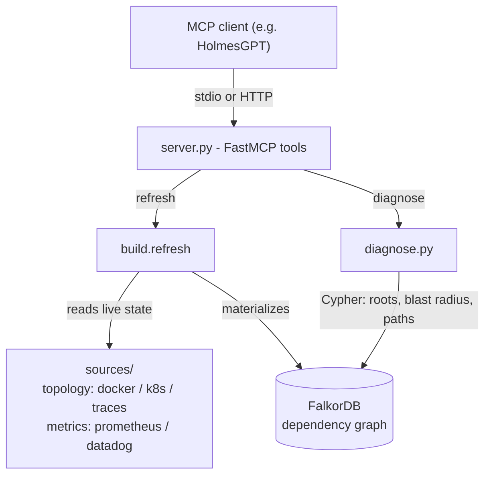

# woodpecker-mcp

[](https://github.com/sspcodeflix/woodpecker-mcp/actions/workflows/ci.yml)


**woodpecker-mcp exposes a materialized service dependency graph as an MCP
toolset.** It provides an LLM-based agent such as
[HolmesGPT](https://github.com/robusta-dev/holmesgpt) with a capability those
agents do not retain on their own: a persistent, queryable graph of how services
depend on one another. Root-cause analysis therefore becomes a deterministic
graph traversal rather than a conclusion re-derived on each investigation.

HolmesGPT remains unmodified. It launches woodpecker-mcp as a subprocess (or
connects over HTTP) and discovers the tools it exposes - no fork, custom image,
or plugin is required.

---

## Why this exists

HolmesGPT markets a "Runtime Dependency Graph", yet its source holds no graph
data structure, no graph database, and no graph-traversal code. Each
investigation infers the relationships on the fly - from traces, Kubernetes
owner-refs, and metric labels - then discards them, and root cause is whatever
the model concludes through a "five whys" prompt. That design is deliberate - it
buys freshness, statelessness, and breadth - but it carries costs that a
materialized graph removes:

| | Holmes (inferred) | woodpecker-mcp (materialized) |
|---|---|---|
| Where relationships live | model context, one investigation | a graph database (FalkorDB) |
| Root cause | reasoned per run (non-deterministic) | deepest-failing-service, one Cypher query (exact, repeatable) |
| Blast radius | re-derived each time | variable-length path traversal |
| Explore it yourself | no | yes (browser UI + Cypher) |
| Blind-spot detection | no | yes |

---

## How it works



The graph is rebuilt from live sources on each query (or from a static topology
file), then all reasoning runs as Cypher against the store.

---

## Quickstart

HolmesGPT already ships the MCP client, so wiring is config-only - no fork, image,
or plugin to build. Install, then let woodpecker-mcp configure itself:

```bash
pip install holmesgpt woodpecker-mcp
woodpecker-mcp init        # guided Q&A -> writes a filled-in .env
woodpecker-mcp setup       # starts the graph backend, waits until ready, registers the toolset
holmes ask "find the root cause of the current incident"
```

`init` asks a few questions (graph backend, topology, metrics) and writes a
`.env`. `setup` starts FalkorDB and merges the `woodpecker-graph` toolset into
`~/.holmes/config.yaml`, so `holmes ask` picks it up automatically - no `-t` flag
needed.

**Other setups**, all in the [integration guide](docs/CONFIGURATION.md): no Docker
or air-gapped (the embedded Kuzu backend), wiring the toolset YAML by hand,
in-cluster over HTTP for the Holmes Operator, and the full configuration reference.

---

## Tools

| Tool | Returns |
|---|---|
| `woodpecker_get_topology` | the materialized graph (services, status, deps) |
| `woodpecker_diagnose_root_cause` | deepest-failing-service + causal chains + blast radius + blind spots + page verdict |
| `woodpecker_get_blast_radius(service, direction)` | transitive upstream/downstream closure |
| `woodpecker_get_service_health(service)` | per-service drill-down |
| `woodpecker_detect_blind_spots` | healthy-but-unmonitored services |

---

## Explore the graph

FalkorDB ships a browser. Open **http://localhost:3000**, pick the `woodpecker`
graph, and run OpenCypher visually, e.g. the blast radius of `db`:

```cypher
MATCH (a:Service)-[:DEPENDS_ON*1..20]->(:Service {name:'db'}) RETURN a
```

Or from Python:

```python
from falkordb import FalkorDB
g = FalkorDB(host="localhost", port=6379).select_graph("woodpecker")
g.query("MATCH (a:Service)-[:DEPENDS_ON*1..20]->(:Service {name:'db'}) "
        "RETURN a.name").result_set
```

---

## CLI (standalone)

```bash
woodpecker-mcp topology      # rebuild + print the service graph
woodpecker-mcp diagnose      # rebuild + print root-cause analysis
woodpecker-mcp refresh       # rebuild the graph only
woodpecker-mcp serve [--http] [--port 8000]   # run the MCP server

# study a topology offline, no live infra:
woodpecker-mcp ingest examples/topology.example.json
WP_AUTO_REFRESH=0 woodpecker-mcp diagnose
```

---

## Configuration

Everything has a working default; set only what points at your infra. Run
`woodpecker-mcp init` to generate a `.env` from a guided Q&A, or put the `WP_*`
vars in the toolset's `env:` block. Three independent seams, mixed and matched:

- **graph** (`WP_GRAPH_BACKEND`): `falkordb` (server, default) or `kuzu` (embedded, no Docker - good for air-gapped)
- **topology** (`WP_TOPOLOGY`): `docker`, `k8s`, or `traces` (Jaeger)
- **metrics** (`WP_METRICS_BACKEND`): `prometheus` (or any PromQL-compatible backend) or `datadog`

Either graph backend sits behind one `GraphStore` interface (Neo4j/Memgraph drop
in the same way). **Every variable, with per-backend deep-dives, validation
commands, and troubleshooting, is in
[docs/CONFIGURATION.md](docs/CONFIGURATION.md).**

---

## Layout

```
woodpecker_mcp/
  server.py      FastMCP tools, stdio + HTTP
  store.py       GraphStore interface; FalkorGraphStore (default), KuzuGraphStore
  build.py       rebuild the graph from sources, or ingest a static topology
  diagnose.py    deterministic root-cause verdict from store queries
  sources/       TopologySource (docker, k8s, traces) + MetricsSource (prometheus, datadog)
  schema.py      status vocabulary
  cli.py         init | setup | serve | topology | diagnose | refresh | ingest
  scaffold.py    init/setup helpers (.env, FalkorDB, Holmes config)
examples/        holmesgpt-toolset.yaml, k8s-deployment.yaml, topology.example.json
docs/            CONFIGURATION.md
tests/           unit tests (test_*.py) + smoke_mcp.py (integration)
```

---

## Development

```bash
pip install -e ".[dev]"                      # pytest + ruff
pre-commit install                           # ruff lint on every commit
pre-commit install --hook-type pre-push      # unit tests before every push

pytest                                       # unit tests - no services needed
ruff check .                                 # lint  (ruff format . to auto-format)
```

Unit tests (`tests/test_*.py`) run offline against fakes. The stdio integration
check needs a live FalkorDB:

```bash
docker run -d -p 6379:6379 -p 3000:3000 falkordb/falkordb:latest
python tests/smoke_mcp.py
```

---

## License

woodpecker-mcp is licensed under [Apache-2.0](LICENSE). It connects to FalkorDB
as a client and does not redistribute it; FalkorDB itself is SSPL-licensed
(source-available) - fine for self-hosting, relevant only if you offer FalkorDB
as a managed service.
